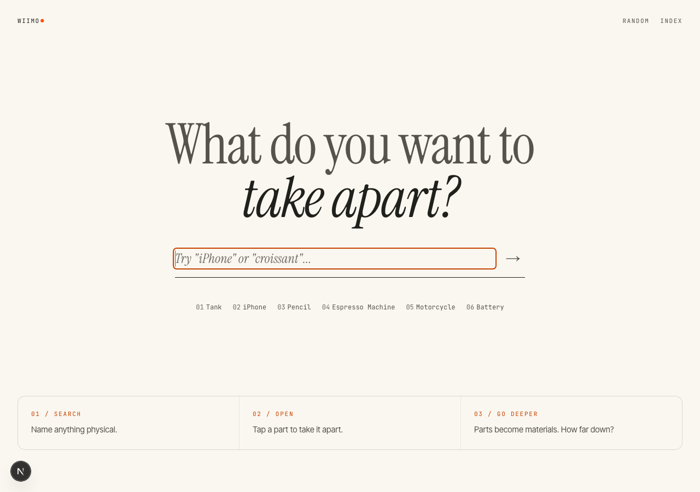
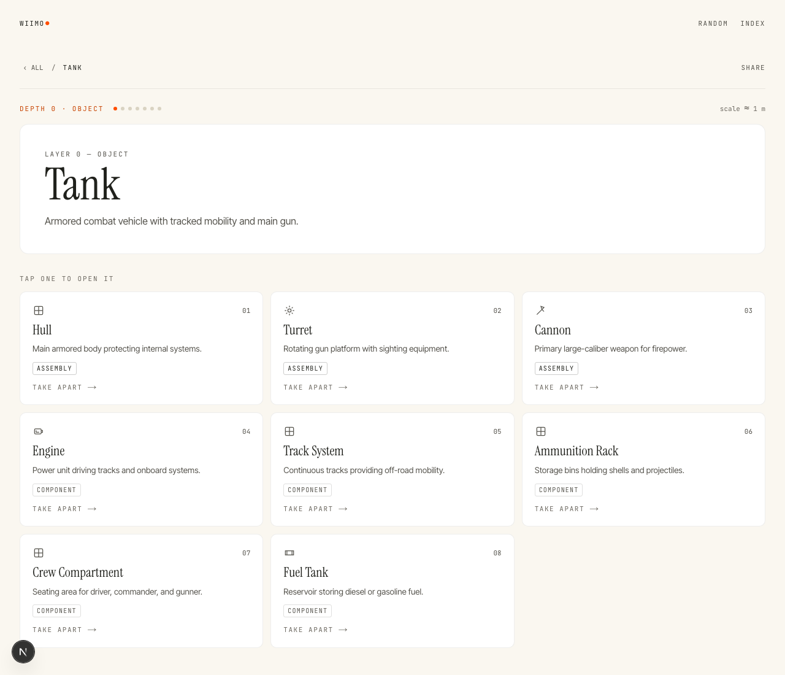

<div align="center">

# What Is It Made Of?

Type any physical thing. AI takes it apart layer by layer — down to atoms.

[](https://nextjs.org)
[](https://react.dev)
[](LICENSE)
[](CONTRIBUTING.md)

A recursive teardown explorer and shared curiosity game for parents and kids.
No accounts, no database, no canned content — every layer is model-generated.




</div>

## How it works

```
browser ──POST /api/decompose──▶ Next.js route ──▶ Gemini ──▶ Groq ──▶ honest 503 + retry
                                     │                │           │
                                  validation    validation   validation
                                  rate-limit      cache      (3-level cache)
```

- **AI-only.** The app presents; the model thinks. There is no fallback content — if all providers are down, the UI shows a retry state, never invented parts.
- **Two providers, automatic failover.** Gemini first, Groq second. Both are here for one reason: they hand out free-tier API keys with no credit card, so the app runs on $0. If either key is missing or its quota is spent, the chain moves on silently. Both responses pass through the same zod validation (`lib/schema.ts`) which coerces off-enum values, drops unusable parts, and rejects thin layers.
- **Composition ladder.** The prompt enforces assemblies → components → materials → molecules → elements by depth, ending at terminal atoms (max depth 6, "bedrock").
- **Three-level cache** (memory → localStorage → server) so repeats, back-navigation, and shared links cost nothing. Hover-prefetch warms caches without ever spending tokens.
- **Token discipline.** Capped outputs, no repair-retries on client errors (429/4xx), rate limit (20 req/min/IP) that exempts cache hits and prefetch.

## Getting started

```bash
npm install
cp .env.example .env.local   # then fill in keys (see below)
npm run dev                  # http://localhost:3000
```

| Variable         | Required | Purpose                                              |
| ---------------- | -------- | ---------------------------------------------------- |
| `GEMINI_API_KEY` | Yes      | Primary provider (Google AI Studio, free tier works) |
| `GEMINI_MODEL`   | No       | Override model (default: `gemini-3.6-flash`)         |
| `GROQ_API_KEY`   | No       | Failover provider ([console.groq.com](https://console.groq.com), free, no card) |
| `GROQ_MODEL`     | No       | Override model (default: `openai/gpt-oss-120b`)      |

Without any key the app runs but every teardown shows the retry state — add at least one key.

## Usage

1. Type an object ("pastel de nata", "iPhone", "Tank") and hit search.
2. Tap any card to open it one layer deeper.
3. Breadcrumb jumps back up; `Random` deals a new thread.
4. `Share` copies a deep link (`?dive=a/b/c`); `Index` shows souvenir stats (local only).

## Scripts

| Command             | Purpose                     |
| ------------------- | --------------------------- |
| `npm run dev`       | Local dev server            |
| `npm run build`     | Production build            |
| `npm run start`     | Serve production build      |
| `npm run typecheck` | Strict TypeScript check     |
| `npm run verify`    | Typecheck + build (pre-push gate) |

## Project structure

```
app/
  page.tsx            # whole UI: home, explore, dialogs (client component)
  layout.tsx          # fonts (next/font), metadata
  globals.css         # daylight-workbench tokens + base styles
  api/decompose/      # AI cascade: validate → cache → Gemini → Groq → 503
hooks/useDecompose.ts # fetch layer: memory/disk cache, dedup, error mapping
lib/
  gemini.ts groq.ts   # providers (throw on failure, route decides)
  schema.ts           # zod contracts + tolerant sanitizer
  normalize.ts        # input normalization, non-physical guard
  cache.ts            # server LRU + request dedup
  ratelimit.ts        # 20 req/min/IP (cache/prefetch exempt)
  store.ts            # localStorage progress + layer cache (quota-safe)
docs/screenshots/     # README images (regenerate with headless Chrome)
```

## Docs

- [`PRODUCT.md`](PRODUCT.md) — product truth (what the app promises)
- [`DESIGN.md`](DESIGN.md) — visual system (palette roles, type roles, components)
- [`CONTRIBUTING.md`](CONTRIBUTING.md) — setup, conventions, PR process

## Known limitations

- Live teardowns need at least one provider key; quotas are the bottleneck, not code.
- Max depth 6 by design; English-only UI; history lives in the browser.

## License

MIT — see [LICENSE](LICENSE).
